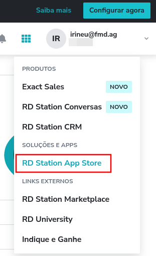
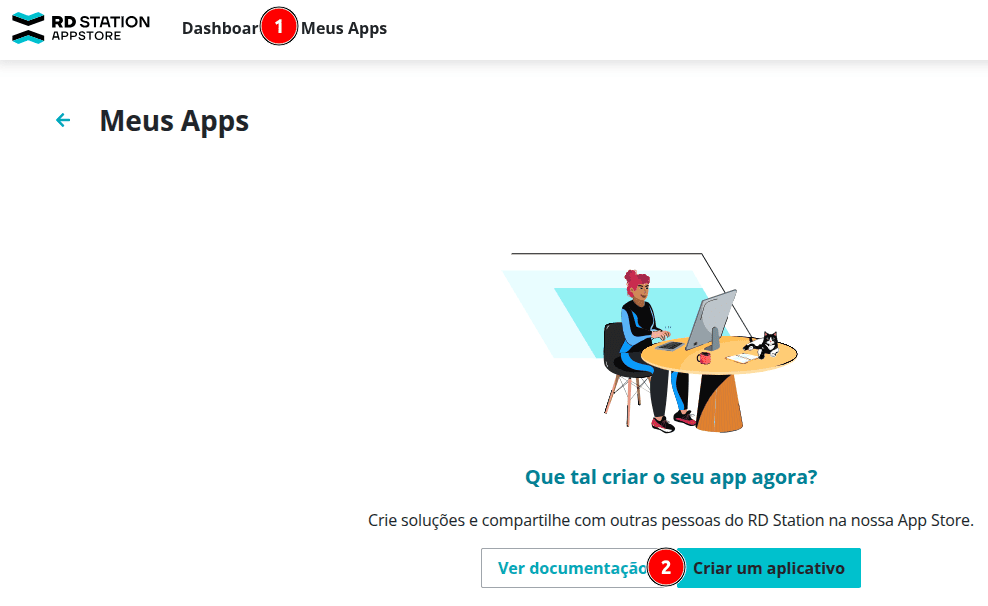
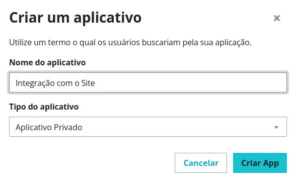
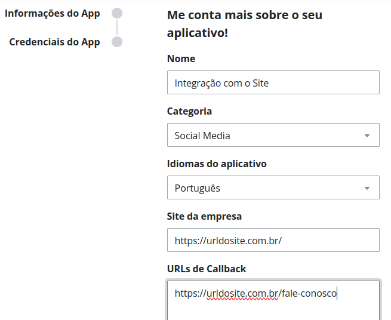
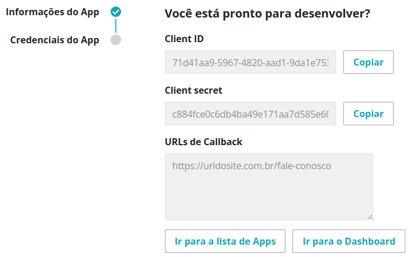
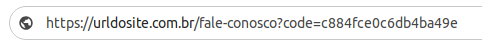

# Laravel – RD Station

[](https://packagist.org/packages/agenciafmd/laravel-rdstation)
[](LICENSE.md)

Envia conversões para a RD Station através de um job em fila, cuidando da renovação do `access_token`, dos retries, do log das requisições e do aviso por e-mail em caso de falha.

## Requisitos

- PHP ^8.4
- Laravel 13.*

## Instalação

```bash
composer require agenciafmd/laravel-rdstation:dev-master
```

O service provider é registrado automaticamente (package discovery).

## Configuração

### Variáveis de ambiente

```dotenv
RDSTATION_CLIENT_ID=
RDSTATION_CLIENT_SECRET=
RDSTATION_REFRESH_TOKEN=
RDSTATION_ERROR_EMAIL=
```

| Variável | Descrição |
|---|---|
| `RDSTATION_CLIENT_ID` | Client ID do aplicativo criado na RD Station App Store |
| `RDSTATION_CLIENT_SECRET` | Client Secret do aplicativo |
| `RDSTATION_REFRESH_TOKEN` | Refresh token usado para gerar o `access_token` |
| `RDSTATION_ERROR_EMAIL` | (Opcional) e-mail que recebe o aviso quando a integração falha |

> Se `client_id`, `client_secret` ou `refresh_token` estiverem vazios, o job termina sem enviar nada.

Os valores são lidos de `config('laravel-rdstation.*')`. O pacote não publica o arquivo de configuração; use apenas o `.env`.

### Gerando as credenciais

Antes de começarmos, é preciso solicitar a criação de uma conta para o desenvolvedor responsável na RD Station.

Com a conta criada, vamos criar o **aplicativo**.

Vá em https://appstore.rdstation.com/

Agora, vamos em **Integrações** > **Quero criar um app para uso privado**



Vá em **Meus Apps** > **Criar um aplicativo**



Escolhemos um nome bem intuitivo e clicamos em **Criar App**



Agora é só seguir os passos.

> Atenção para a URL de redirecionamento, ela é importante para a autenticação.

É a partir dela que vamos conseguir recuperar o **code**.



Após a criação, copiamos o **Client ID** e o **Client Secret**.



Para conseguirmos o code, vamos trocar o **client_id** e o **redirect_uri** com os dados que recuperamos do nosso app.

```text
https://api.rd.services/auth/dialog?client_id=client_id&redirect_uri=redirect_uri&state=
```

Se tudo correr bem, seremos redirecionados para a URL de callback que inserimos no nosso app.

Vamos agora copiar o **code** da URL.



Agora vamos recuperar o **access_token** e o **refresh_token**.

Para isso, vamos fazer uma requisição **POST** para o endpoint **/auth/token?token_by=code**.

No exemplo abaixo, vamos trocar o **client_id**, **client_secret** e **code** pelos valores que recuperamos do nosso app.

```shell
curl --request POST \
     --url 'https://api.rd.services/auth/token?token_by=code' \
     --header 'accept: application/json' \
     --header 'content-type: application/json' \
     --data '
{
  "client_id": "client_id",
  "client_secret": "client_secret",
  "code": "code"
}
'
```

Algo muito semelhante a isso será retornado (note que omitimos um bom pedaço dos dados).

```json
{
    "access_token": "eyJ0eXAiOiJKV1QiLCJhbGciOiJSUzI1NiJ9...",
    "expires_in": 86400,
    "refresh_token": "1-GZ7PR4V5tsS..."
}
```

Agora temos todos os dados necessários para a configuração.

```dotenv
RDSTATION_CLIENT_ID=71d41aa9-5967-4820-aad1-9da1e753d2d1
RDSTATION_CLIENT_SECRET=a140c4683eca43d092fc2837c4efdf46
RDSTATION_REFRESH_TOKEN=1-WX7PR4V5cvSaX9K-9qvcCQm8fPOkhWSM5i6fuTkYY
```

## Uso

Envie os campos no formato de array para o job `SendConversionsToRdstation`. O array é enviado como `payload` de um evento `CONVERSION` (`event_family: CDP`) em `https://api.rd.services/platform/events`.

> O campo **email** é obrigatório.

Como o envio acontece em fila, os valores dos cookies (UTMs, gclid etc.) precisam ser lidos no momento da requisição e passados para o job, conforme o exemplo abaixo.

> Os campos **cf_assunto_de_interesse** e **cf_empreendimento** são campos customizados criados na RD Station e podem variar de acordo com cada cliente.

```php
use Agenciafmd\Rdstation\Jobs\SendConversionsToRdstation;
use Illuminate\Support\Facades\Cookie;

$data['email'] = 'irineu@fmd.ag';
$data['name'] = 'Irineu Junior';
$data['phone'] = '(17) 99999-9999';

SendConversionsToRdstation::dispatch($data + [
        'conversion_identifier' => 'seja-um-parceiro',
        'mobile_phone' => $data['phone'],
        'cf_assunto_de_interesse' => 'assunto',
        'cf_empreendimento' => 'nome-do-empreendimento',
        'cf_utm_campaign' => Cookie::get('utm_campaign', ''),
        'cf_utm_content' => Cookie::get('utm_content', ''),
        'cf_utm_medium' => Cookie::get('utm_medium', ''),
        'cf_utm_source' => Cookie::get('utm_source', ''),
        'gclid_' => Cookie::get('gclid', ''),
        'cid' => Cookie::get('cid', ''),
    ])
    ->delay(5)
    ->onQueue('low');
```

### Comportamento do job

- O `access_token` é obtido a partir do `refresh_token` e fica em cache (`rdstation-api-token`) por 40 minutos.
- Até 4 tentativas, com backoff de 10, 30 e 60 segundos.
- Cada requisição e o status da resposta são registrados em `storage/logs/rdstation-YYYY-MM-DD.log`.
- Se a RD Station recusar a conversão, ou o job falhar em todas as tentativas, um e-mail com o motivo é enviado para `RDSTATION_ERROR_EMAIL` (quando preenchido).

## Filas

Nos exemplos, o job é enviado para a fila **low**.

Certifique-se de que o seu `queue:work` esteja processando essa fila, algo semelhante ao abaixo.

```shell
php artisan queue:work --tries=3 --delay=5 --timeout=60 --queue=high,default,low
```

## Licença

Este pacote é software livre e está disponível nos termos da licença MIT.
