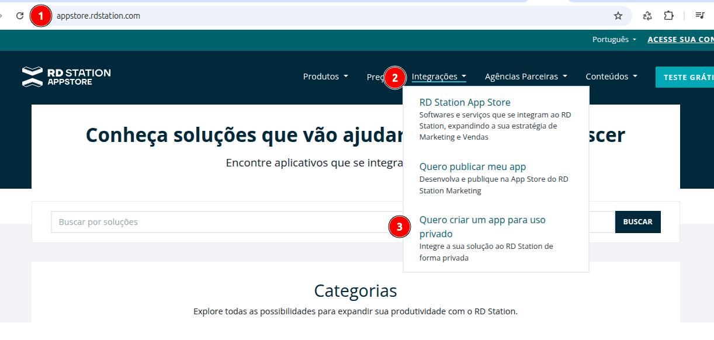
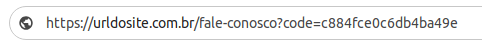

## Laravel - RD Station

[](https://packagist.org/packages/agenciafmd/laravel-rdstation)
[](LICENSE.md)

- Envia as conversões para o RD Station

## Instalação

```bash
composer require agenciafmd/laravel-rdstation:dev-master
```

## Configuração V2

Para que a integração seja realizada, precisamos do **token público**

Para isso, vamos em **Perfil > Integrações**


Agora, vamos em **Dados da Integração > Token Público**


Colocamos esta chave no nosso .env

```dotenv
RDSTATION_PUBLIC_KEY=VYfa6Oo1oaCIeQ68Ase9dSOBPdgRvWtJ
```

## Uso

Envie os campos no formato de array para o SendConversionsToRdstation.

O campo **email** é obrigatório =)

Para que o processo funcione pelos **jobs**, é preciso passar os valores dos cookies conforme mostrado abaixo.

```php
use Agenciafmd\Rdstation\Jobs\SendConversionsToRdstation;

$data['email'] = 'irineu@fmd.ag';
$data['nome'] = 'Irineu Junior';

SendConversionsToRdstation::dispatch($data + [
        'identificador' => 'seja-um-parceiro',
        'utm_campaign' => Cookie::get('utm_campaign', ''),
        'utm_content' => Cookie::get('utm_content', ''),
        'utm_medium' => Cookie::get('utm_medium', ''),
        'utm_source' => Cookie::get('utm_source', ''),
        'utm_term' => Cookie::get('utm_term', ''),
        'gclid_' => Cookie::get('gclid', ''),
        'cid' => Cookie::get('cid', ''),
    ])
    ->delay(5)
    ->onQueue('low');
```

----

## Configuração V2

Antes de começarmos, é preciso solicitar a criação de uma conta para o desenvolvedor responsável na RD Station.

Com a conta criada, vamos criar o **aplicativo**

Vá em https://developers.rdstation.com/

Faça seu login e escolha o cliente (caso possua mais de um) e clique em **Acessar RD Station Marketing**


No menu **Produtos**, clique em **RD Station App Store**



Agora, vamos em **Meus Apps** > **Criar um aplicativo**

Escolhemos um nome bem intuitivo e clicamos em **Criar App**


Agora é só seguir os passos.

> Atenção para a URL de redirecionamento, ela é importante para a autenticação.

É a partir dela, que vamos conseguir recuperar o **code**


Após a criação, copiamos o **Client ID** e o **Client Secret**


Para conseguirmos o code, vamos trocar o **client_id** e o **redirect_uri** com os dados que recuperamos do nosso app.

```
https://api.rd.services/auth/dialog?client_id=client_id&redirect_uri=redirect_uri&state=
```

Se tudo correr bem, seremos redirecionado para a url de callback que inserimos no nosso app.

Vamos agora, copiar o **code** da url.



Agora vamos recuperar o **access_token** e o **refresh_token**.

Para isso, vamos fazer uma requisição **POST** para o endpoint **/auth/token?token_by=code**

No exemplo abaixo, vamos trocar o **client_id**, **client_secret** e **code** pelos valores que recuperamos do nosso app.

```shell
curl --request POST \
     --url 'https://api.rd.services/auth/token?token_by=code' \
     --header 'accept: application/json' \
     --header 'content-type: application/json' \
     --data '
{
  "client_id": "client_id",
  "client_secret": "client_secret",
  "code": "code"
}
'
```

Algo muito semelhante a isso será retornado (note que comemos um bom pedaço dos dados).

```json
{
    "access_token": "eyJ0eXAiOiJKV1QiLCJhbGciOiJSUzI1NiJ9...",
    "expires_in": 86400,
    "refresh_token": "1-GZ7PR4V5tsS..."
}
```

Agora tem conseguimos todos os dados necessários para a configuração.

```dotenv
RDSTATION_CLIENT_ID=71d41aa9-5967-4820-aad1-9da1e753d2d1
RDSTATION_CLIENT_SECRET=a140c4683eca43d092fc2837c4efdf46
RDSTATION_REFRESH_TOKEN=1-WX7PR4V5cvSaX9K-9qvcCQm8fPOkhWSM5i6fuTkYY
```

## Uso

Envie os campos no formato de array para o SendConversionsToRdstationV2.

O campo **email** é obrigatório =)

Para que o processo funcione pelos **jobs**, é preciso passar os valores dos cookies conforme mostrado abaixo.

> Note que os campos **cf_assunto_de_interesse** e **cf_empreendimento** são campos customizados que criamos no RD Station e podem variar de acordo com cada cliente.

```php
use Agenciafmd\Rdstation\Jobs\SendConversionsToRdstationV2;

$data['email'] = 'irineu@fmd.ag';
$data['nome'] = 'Irineu Junior';

SendConversionsToRdstationV2::dispatch($data + [
        'conversion_identifier' => 'seja-um-parceiro',
        'mobile_phone' => $data['phone'],
        'cf_assunto_de_interesse' => 'assunto',
        'cf_empreendimento' => 'nome-do-empreendimento',
        'traffic_source' => Cookie::get('utm_source', ''),
        'traffic_medium' => Cookie::get('utm_medium', ''),
        'traffic_campaign' => Cookie::get('utm_campaign', ''),
        'traffic_value' => Cookie::get('utm_term', ''),
        'client_tracking_id' => Cookie::get('cid', '') . '|' . Cookie::get('gclid', ''),
    ])
    ->delay(5)
    ->onQueue('low');
```


## Queue

Note que nos nossos exemplos, enviamos o job para a fila **low**.

Certifique-se de estar rodando no seu queue:work esteja semelhante ao abaixo.

```shell
php artisan queue:work --tries=3 --delay=5 --timeout=60 --queue=high,default,low
```